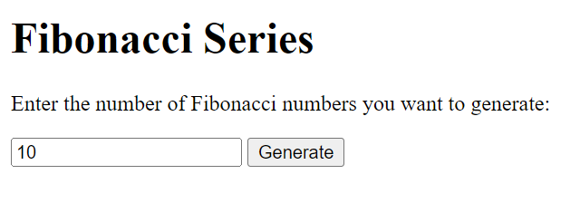

Fibonacci Series Generator

This is a simple web application that generates the Fibonacci series based on the user's input.

Features:  

1. Allows users to input the number of Fibonacci numbers they want to generate.
2. Generates the Fibonacci series up to the specified number.
3. Displays the generated Fibonacci series on the web page.

Usage:  

    - Open the HTML file (index.html) in a web browser.
    - Enter the desired number of Fibonacci numbers you want to generate in the input field.
    - Click the "Generate" button.
    - The Fibonacci series up to the specified number will be displayed on the web page.

Screenshots

Credits:

This project was created by [Your Name].

License:

This project is licensed under the MIT License - see the LICENSE file for details.